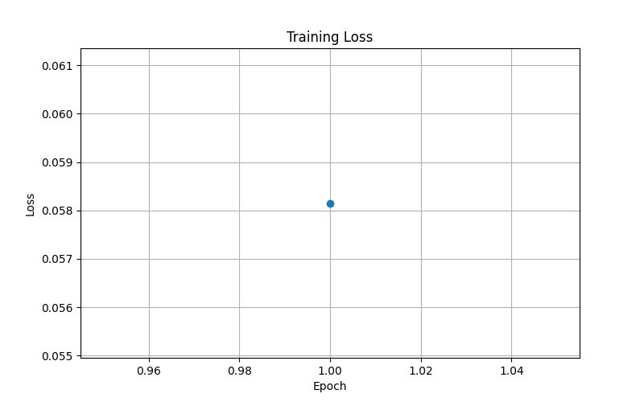

# Email Spam Detection using BERT

## Overview

This project implements an Email Spam Detection system using **BERT (Bidirectional Encoder Representations from Transformers)** and **PyTorch**. The model is fine-tuned to classify emails as either **Spam** or **Not Spam**.

The project demonstrates the application of transformer-based Natural Language Processing (NLP) techniques for email classification and spam filtering.

---

## Features

* Fine-tuned BERT model for binary text classification
* Email spam detection using NLP
* Training and evaluation pipeline using PyTorch
* Progress tracking with tqdm
* Model saving and loading support
* Training loss visualization

---

## Dataset

The dataset contains **83,448 labeled email messages**.

### Columns

| Column | Description              |
| ------ | ------------------------ |
| text   | Email content            |
| label  | Spam (1) or Not Spam (0) |

For training, a subset of **80,000 emails** was used.

### Train-Test Split

* Training Set: 64,000 emails
* Test Set: 16,000 emails
* Split Ratio: 80:20

---

## Model Architecture

The project uses:

* BERT Base Uncased
* PyTorch
* Hugging Face Transformers

Model:

```python
BertForSequenceClassification(
    "bert-base-uncased",
    num_labels=2
)
```

---

## Performance

### Evaluation Results

| Metric    | Score   |
| --------- | ------- |
| Accuracy  | 98.99%  |
| Precision | 99%     |
| Recall    | 98–100% |
| F1 Score  | 99%     |

Classification Report:

```text
Accuracy: 0.9899

Not Spam
Precision: 0.99
Recall: 0.98
F1-Score: 0.99

Spam
Precision: 0.99
Recall: 1.00
F1-Score: 0.99
```

---

## Project Structure

```text
Email-Spam-Detection-BERT/
│
├── email_spam_detection_bert.ipynb
├── README.md
├── requirements.txt
├── loss_curve.png
│
└── spam_classifier_model/
    ├── config.json
    ├── model.safetensors
    ├── tokenizer.json
    └── tokenizer_config.json
```

---

## Installation

Clone the repository:

```bash
git clone https://github.com/your-username/Email-Spam-Detection-BERT.git
cd Email-Spam-Detection-BERT
```

Install dependencies:

```bash
pip install -r requirements.txt
```

---

## Requirements

```text
torch
transformers
pandas
matplotlib
scikit-learn
tqdm
```

---

## Running the Project

Open the notebook:

```bash
jupyter notebook
```

Run:

```text
email_spam_detection_bert.ipynb
```

The notebook will:

1. Load the dataset
2. Tokenize email text
3. Fine-tune BERT
4. Evaluate performance
5. Generate a loss curve
6. Save the trained model

---

## Results

The fine-tuned BERT model achieved **98.99% accuracy** on a held-out test set of **16,000 emails**, demonstrating excellent performance for email spam classification.

### Training Loss Curve



### Evaluation Metrics

| Metric    | Score   |
| --------- | ------- |
| Accuracy  | 98.99%  |
| Precision | 99%     |
| Recall    | 98–100% |
| F1 Score  | 99%     |

The model was trained on **80,000 labeled emails** sampled from a dataset containing **83,448 email messages**.


---

## Streamlit Web App

A simple web interface was built using Streamlit that allows users to paste email content and classify it as:

- Spam
- Not Spam

Run locally:

```bash

streamlit run app.py

---

## Author

**Naman Goyal**

Computer Science Engineering Student

Machine Learning | Cybersecurity | Artificial Intelligence
